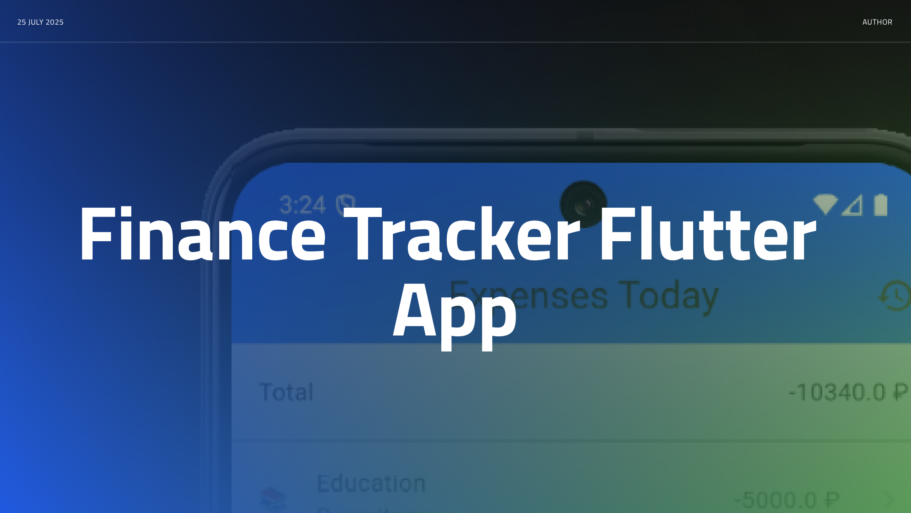
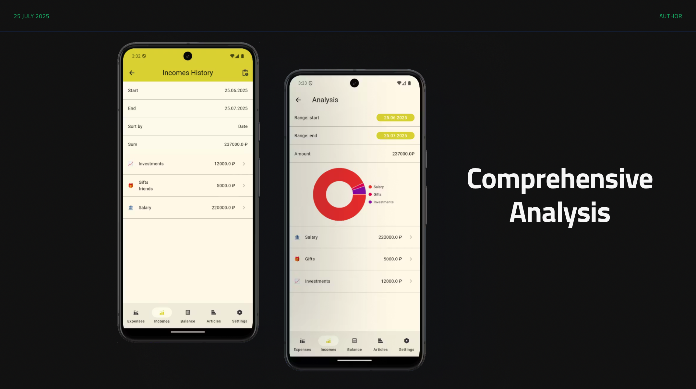
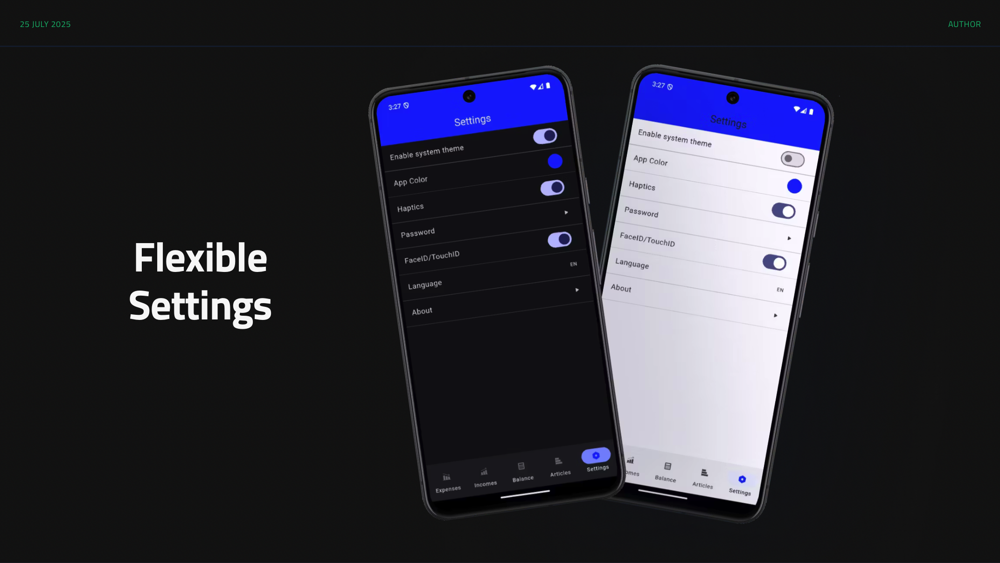
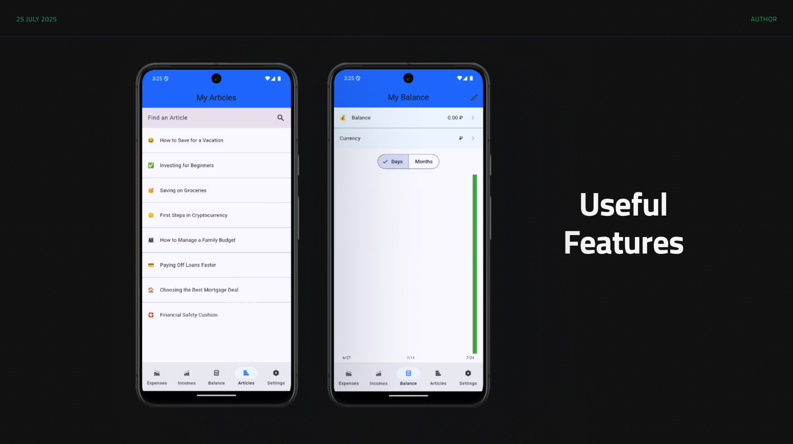

# Finance Tracker

Finance Tracker is a full featured Flutter application used for tracking personal expenses and income. It showcases a modular feature-first architecture built with Riverpod and ObjectBox. A custom animated pie chart package is also included.










## Features

- Add, edit and delete income or expense transactions with custom categories.
- Browse today's transactions and view history with flexible date filters and sorting.
- Analyze spending using an animated pie chart grouped by category.
- Monitor account balance over time using charts.
- Biometric or PIN-code authentication protects your data.
- Helpful finance articles with fuzzy search.
- Theme customization with dynamic accent colors.
- Works completely offline thanks to ObjectBox local storage seeded with mock data.

## Architecture

The project follows a feature-first layout. Each feature exposes its own `data`, `domain` and `presentation` layers through Riverpod providers.

```text
lib/
  core/        # navigation, network and theming
  features/
    account/
    articles/
    auth/
    balance/
    settings/
    transactions/
  shared/      # reusable data sources and widgets
  util/        # helpers such as logging
packages/
  animated_pie_chart/  # local chart widget package
```

Repositories abstract local and remote data sources. Riverpod manages dependency injection and state. ObjectBox acts as the offline-first database, so the app functions without network connectivity.

## Getting Started

1. Install [Flutter](https://flutter.dev/docs/get-started/install) (version 3.7 or newer).
2. Fetch the dependencies:

   ```bash
   flutter pub get
   ```

3. Generate freezed, JSON serialization and ObjectBox bindings:

   ```bash
   dart run build_runner build --delete-conflicting-outputs
   ```

4. Run the application on a device or emulator:

   ```bash
   flutter run
   ```

Mock data for categories, articles and transactions is inserted on first launch from `lib/shared/data/datasources/mock_data.dart`.

## License

This project is provided for educational purposes and does not include production-ready financial advice.
